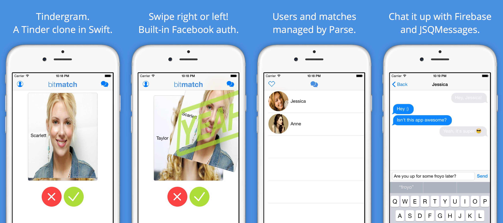

# Tindergram
Tinder clone in Swift.

#Features
- Facebook authentication
- Parse backend (for storing user information)
- Send and receive messages with Firebase

## How to try this out
1. Use the out-of-the-box code, with small changes
2. Create your own Parse, Facebook, and Firebase app

Below, I walk you through the set up. If you still need help: @thomasmeagher or tom@meagher.co.

## Initial Set up
1. Clone the repo
2. Open Tindergram.xcworkspace (important)

## Setting up Parse
1. Sign up or login to [Parse](https://parse.com)
2. Create a new app
3. Add a new class of type, User
4. Go to Constants.swift and insert your parseAppID and parseClientKey

## Setting up Facebook
1. Go to [Facebook Developer](https://developers.facebook.com)
2. Add a new app
3. Configure your info.plist and bundle identifier (the quickstart guide walks through this process)

## Setting up Firebase
1. Sign up or login to [Firebase](https://firebase.com)
2. Create a new app
3. Go to Constants.swift and insert your firebaseAppURL

## Wrapping Up
1. Run the app and login
2. Check Parse. If everything worked correctly, you should now appear as a user.
3. You will want to add test users in Parse so that you have people to swipe through
4. Enjoy

## License
Tindergram is released under the MIT license. See LICENSE for details.

*Credit to Bitfountain for their [awesome iOS 8 Course](http://bitfountain.io/courses/complete-ios8) and app assets*
